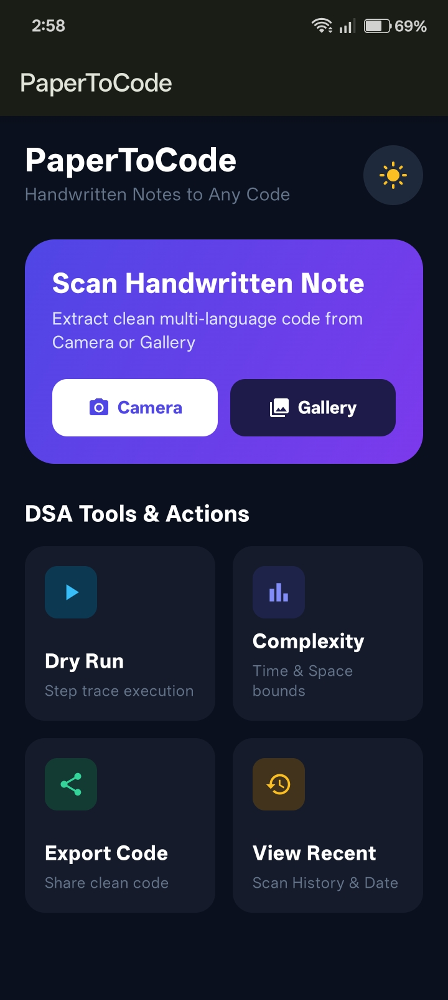
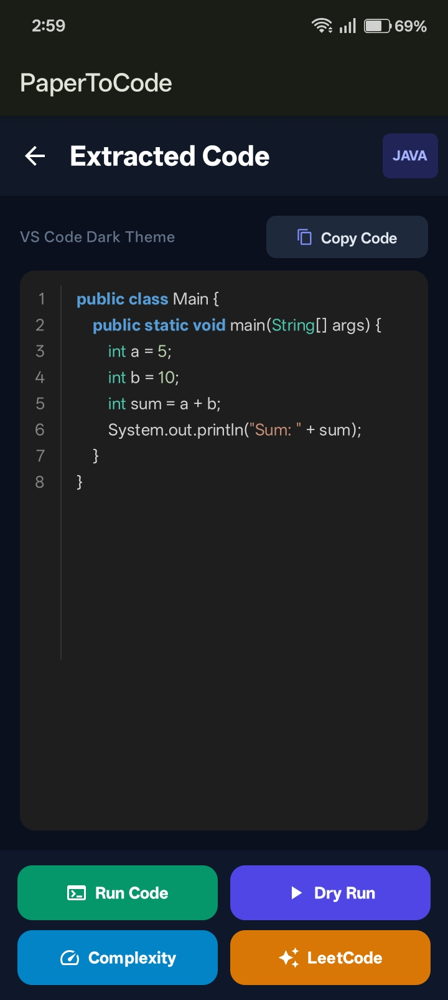
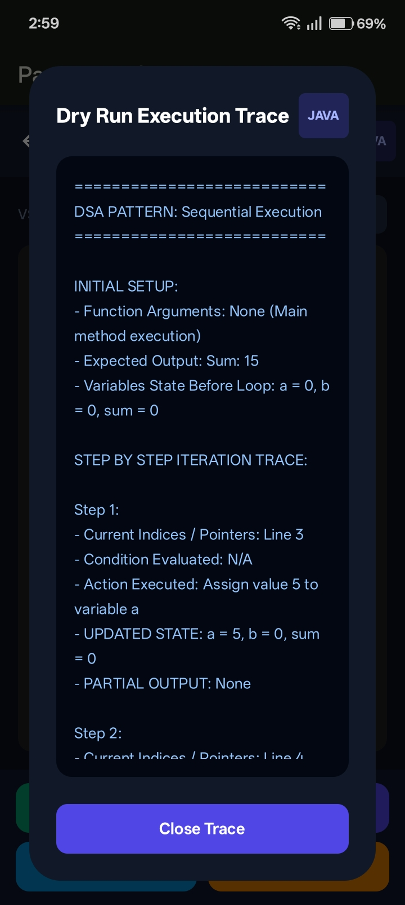
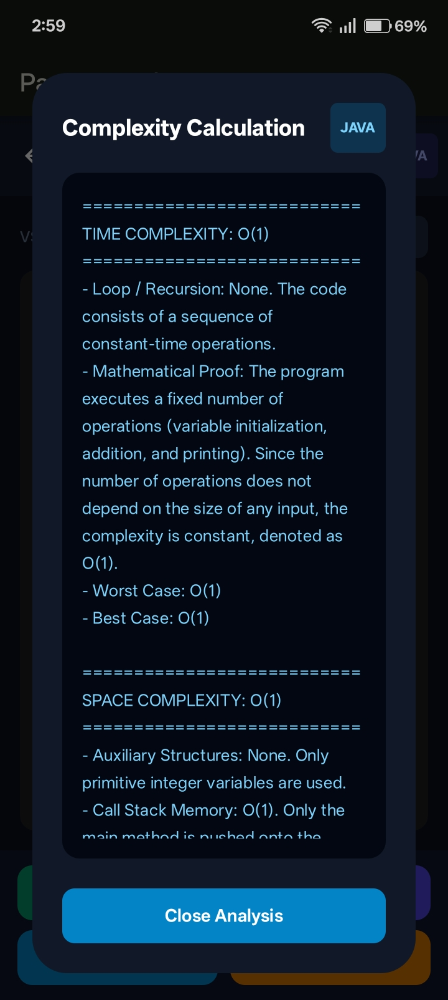
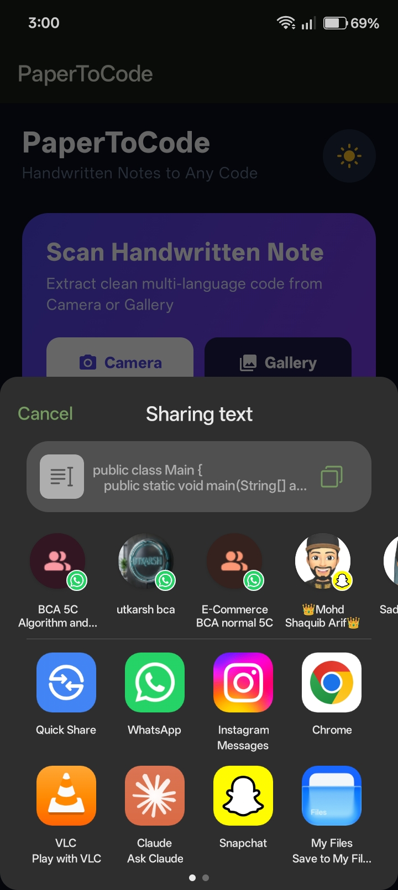
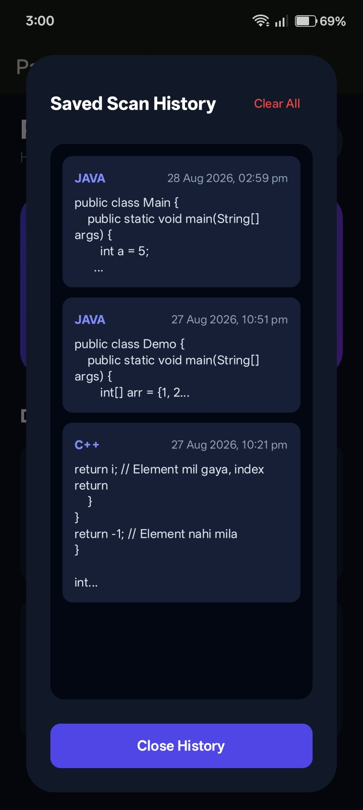

# 📱 PaperToCode

**PaperToCode** is a native Android developer utility application that bridges the gap between offline problem-solving and digital execution. It captures handwritten or printed programming logic (DSA solutions) written on paper and converts it into clean, execute-ready, structured digital code.

---

## 🎯 Problem Statement

Developers and students often solve DSA problems on paper first — sketching logic, dry-running loops, and writing pseudo-code by hand. Converting this into properly formatted, working code is a manual and time-consuming step. **PaperToCode automates this bridge**, turning a photo of handwritten code into structured, analyzable, and testable digital code.

---

## ✨ Core Features

### 🔍 AI-Powered OCR Engine
Uses the **Google Gemini Generative AI SDK** to extract precise syntax from images of handwritten or printed code, automatically correcting minor syntax errors during extraction.

### 🧹 Algorithm Standardizer & Formatter
Formats extracted logic into clean **Java/Kotlin** conventions, improves readability, and ensures explicit control flow (proper if-else branching, indentation, structure).

### ▶️ Dry Run & Custom Testing
Simulate a **dry run directly on-device** — provide custom input parameters and trace the output without needing an external compiler or IDE.

### 📊 Complexity Analyzer
Automatically analyzes the algorithm's control flow to compute its **Time Complexity** and **Space Complexity**.

### 💾 Local Persistence (Offline-First)
All scans, generated code, dry-run notes, and complexity metrics are stored locally using **Room Database**, allowing users to search and revisit past solutions anytime — fully offline.

---

## 🏗️ Tech Stack

| Layer | Technology |
|---|---|
| **UI** | Jetpack Compose (Material 3) |
| **Architecture** | MVVM + Clean Architecture |
| **State & Concurrency** | Kotlin Coroutines & Flow |
| **Local Storage** | Room Persistence Library |
| **AI Engine** | Google Gemini API (Vision Model) |


---

## 🧠 Architecture Overview

```
┌─────────────────────┐
│   Presentation      │  Jetpack Compose UI + ViewModels
│   (MVVM)            │
└─────────┬───────────┘
          │
┌─────────▼───────────┐
│      Domain         │  Use Cases / Business Logic
│                     │
└─────────┬───────────┘
          │
┌─────────▼───────────┐
│       Data          │  Room DB (local) + Gemini API (remote)
│                     │
└─────────────────────┘
```
The app follows *Clean Architecture* principles with clear separation between UI, business logic, and data layers, using *Kotlin Flow* for reactive state updates across async operations (API calls, DB queries).

---

## 📸 Screenshots / Demo

<table>
  <tr>
    <td align="center"><b>Home Screen</b><br/>Scan via Camera/Gallery + quick access to DSA tools</td>
    <td align="center"><b>Extracted Code</b><br/>Clean, syntax-highlighted code from the handwritten scan</td>
  </tr>
  <tr>
    <td></td>
    <td></td>
  </tr>
  <tr>
    <td align="center"><b>Dry Run Execution Trace</b><br/>Step-by-step variable state tracing</td>
    <td align="center"><b>Complexity Calculation</b><br/>Auto-computed Time & Space complexity with reasoning</td>
  </tr>
  <tr>
    <td></td>
    <td></td>
  </tr>
  <tr>
    <td align="center"><b>Related LeetCode Practice</b><br/>Pattern-based problem recommendations</td>
    <td align="center"><b>Export Code</b><br/>Share extracted code directly to other apps</td>
  </tr>
  <tr>
    <td></td>
    <td></td>
  </tr>
  <tr>
    <td align="center"><b>Saved Scan History</b><br/>Offline-first Room DB storage of past scans</td>
    <td></td>
  </tr>
  <tr>
    <td></td>
    <td></td>
  </tr>
</table>

---
## 🚀 Getting Started

### Prerequisites
- Android Studio (latest stable)
- Minimum SDK: 24 (Android 7.0+)
- A Google Gemini API key

### Setup
1. **Clone the repository:**
   ```bash
   git clone [https://github.com/Faheem4hmad/Paper-To-Code.git](https://github.com/Faheem4hmad/Paper-To-Code.git)
2. Configure API Key:
Create ApiKeyProvider.kt inside app/src/main/java/com/example/papertocode/data/remote/:
 
  ```
package com.example.papertocode.data.remote
 object ApiKeyProvider {
    const val API_KEY = "YOUR_GEMINI_API_KEY_HERE"
   }
   ```
3.  Sync Gradle and run the app on an emulator or physical device.

## 🗺️ Roadmap
[ ] Publish to Google Play Store

[ ] Support additional languages (Python, C++)

[ ] Improve OCR accuracy for cursive/messy handwriting

[ ] Export scanned solutions as shareable code snippets

[ ] Add tags/categories for organizing saved solutions

##📄 License
This project is licensed under the MIT License — see the LICENSE file for details.

## 👤 Author
   Faheem Ahmad

## GitHub: @Faheem4hmad

⭐ Show Your Support
Give a ⭐️ if this project helped you!
